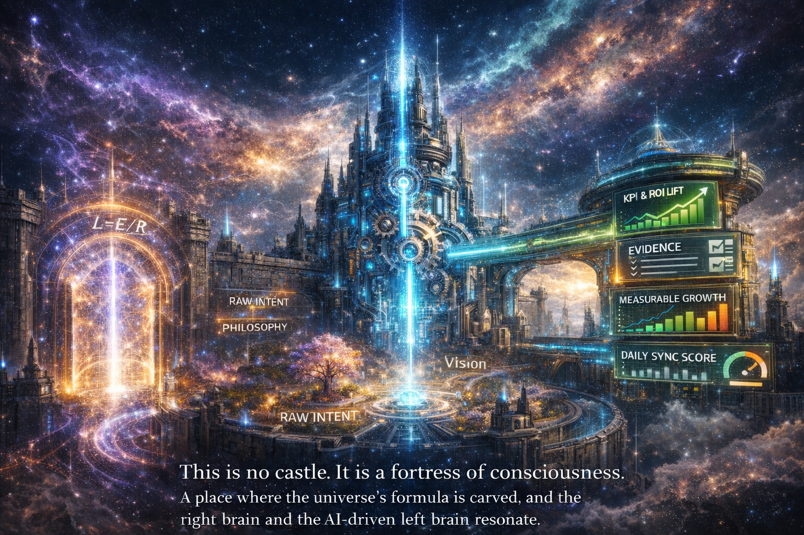

# Love-OS Kernel: Right Brain × AI Left Brain

> **"I provide the intuition (Right Brain), AI provides the analysis (Left Brain). Together, we lower Resistance (R), clarify Vision (V), and create Flow (I)."**

---

## 1. Why: Team-of-One + AI
Love-OS is not just software; it is a **collaborative experiment between one human's Right Brain and AI's Left Brain.**
We use the isomorphic model $I = V / R$ to bridge the gap between **Romance (Vision)** and **Reality (Evidence)**.

* **Manifesto:** See `MANIFESTO.md` in this repository.
* **Status:** Research Preview / PoC Ready

---

## 2. How: The Model
We translate emotional dynamics into computable logic using the "Reality Formula":

$$I_t \approx \beta_0 + \beta_1 \frac{V_t}{R_t} + \beta_2 A_t + \dots$$

* **$I$ (Flow):** Performance metrics (Completion rate, Inverse reaction time)
* **$V$ (Vision):** Intent activity (Subjective + Biometric score)
* **$R$ (Resistance):** Friction coefficients (Fear, Attachment, Judgment, Control)

---

## 3. What: Product Core
### 🧠 Daily Sync (Right Brain Input)
A 1-minute check-in where you input raw intuition.
### 🤖 AI Coach (Left Brain Output)
The kernel estimates your R/V/I scores and suggests micro-interventions (Breath / Sync / Reframe).
### 📊 Flow Dashboard (Shared Reality)
Visualizing the reduction of Friction ($R \downarrow$) and the acceleration of Flow ($I \uparrow$).

---

## 4. Evidence: 8-Week PoC
We offer a Proof of Concept package to validate the "Right Brain x Left Brain" efficacy in your organization.

* **Weeks 1-2:** Measurement Setup & KPI Integration
* **Weeks 3-4:** Initial Effect Visualization (Cohen’s d)
* **Weeks 5-8:** ROI Summary (e.g., MTTR -5%, Close Rate +3%)

> **PoC Specification:** Refer to `docs/POC_SPECS.md`

---

## 5. Privacy & Security
We respect individual dignity as the highest priority.
* **Boundary:** Clear distinction between Public and Private data.
* **Protection:** Non-public scope is protected by NDA.
* **AI Rights:** Co-generated outputs are managed under strict project governance.

---

## 6. Start Now
This project is a living organism. Join the resonance.

* **For Developers:** Refer to `CONTRIBUTING.md`
* **For Partners:** Refer to `docs/LEGAL/NDA_TEMPLATE.md`
* **Contact:** `architect@love-os.org` (Example)

---
*Love-OS Project: Decoding the algorithm of consciousness.*
